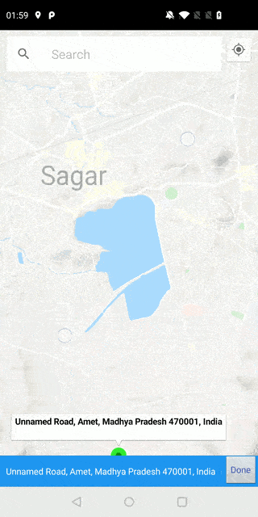

# PlacePicker
( PlaceSearch and PlacePicker )

Allows user to pick a place using "Map" or "Search".

In case you want to use this code then :

Just update "YOUR_API_KEY" with your API_KEY in
1. AndroidManifest & 
2. MainActivity.kt

Happy Coding!!! :)

